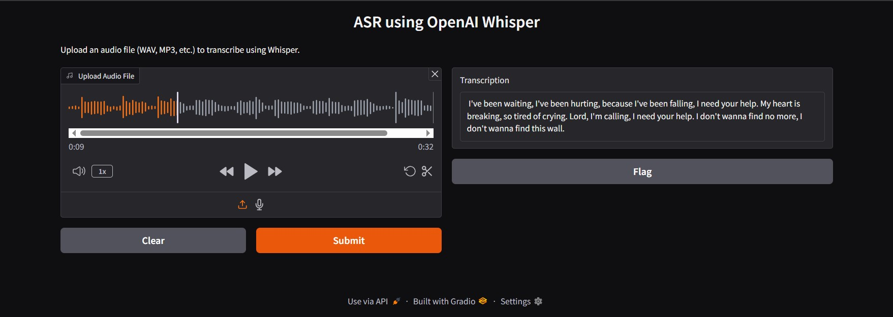

# 🎧 ASR: Automatic Speech Recognition using Whisper

This project uses OpenAI's Whisper model and Gradio to transcribe audio files into text.

## 📸 Interface Preview



## 🚀 Features
- Upload `.mp3`, `.wav`, or similar audio files
- Get automatic transcription using Whisper
- Simple and clean Gradio web interface

## 🛠️ How to Run

```bash
pip install gradio openai-whisper
python your_script_name.py
